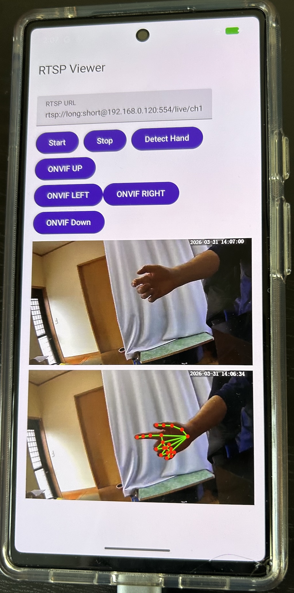

# Simple_Android_RTSP_Viewer
Simple Android RTSP Viewer with MediaCodec, no FFMPEG or VLC

RTSP server : Jennov model HS4007, SD mode 640x360

h.264 MediaCodec HW decoder delay average = 12ms on Pixel 6 

Frame delay 250ms to 350ms on Pixel 6

Call Google MediaPipe hand landmarker.

{width=50% height=50%}

{width=50% height=50%}
{width=50% height=50%}
{width=50% height=50%}

{width=50% height=50%}
